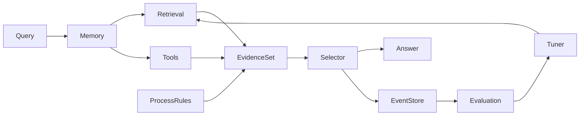

# 架构参考

> 能力分层与决策流概览。决策语义详见 [语义规范](specification.md)。

## 系统定位

**Insurance Closed-Loop Decision Runtime** — 非聊天机器人、非纯 RAG 演示。核心是一次查询的 **可证明决策回合**：候选生成 → 证据采纳 → 投影回答 → 事件固化 → 重放评估 → 反馈调参。

## 决策流（因果序）

## 能力分层

| 层 | 职责 | 在决策中的角色 |
|----|------|----------------|
| Knowledge | 产品、条款、法规、FAQ | 候选内容来源 |
| Ontology | 实体关系图 | 检索扩展上下文 |
| Process | 理赔 / 核保状态机 | 产生 process candidates |
| Decision | 规则引擎 | 产生 rule candidates |
| Runtime | 编排、工具、检索、Selector | **执行决策回合** |
| Evaluation | 评分、幻觉检测、反馈 | 闭环验证与调参 |
| Console | Trace / Memory / Retrieval UI | **可观测投影**（非真值） |

## 与 v2 的主要差异（v3.0）

| 维度 | v2 | v3.0 |
|------|-----|------|
| 证据 | 平铺 list 进 Answer | CanonicalEvidenceSet + Selector |
| 真值 | 部分合成 trace | event_store 唯一真值 |
| Retrieval | 可观测为主 | candidates 进采纳门 |
| Cache | 静默返回 | `CACHE_HIT` + replay 事件链 |
| Memory | 主要 planner | 扩展 `retrieval_query` |

## 知识资产

结构化资产位于 `knowledge_pack/`（产品、法规、规则、流程模型）。运行时懒加载路径见 [开发者指南 — 数据灌入](developer_guide.md#数据灌入)。
